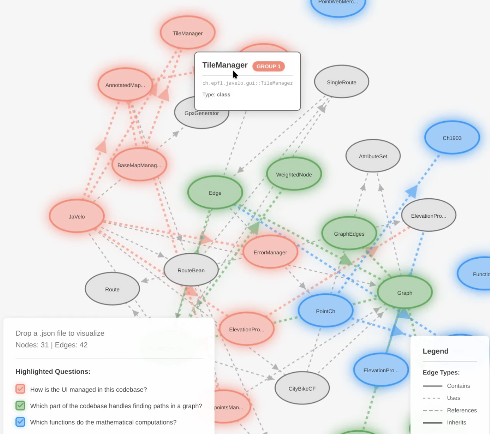

# BrainsGraph: Interactive QA code visualization



## Code Graph MCP Server

An MCP server for managing code graph structures that can be visualized with d3.js. Highlight code elements to answer questions visually in an interactive graph.

## Features

This server provides tools to create and manage a graph representation of your codebase:

- **add_nodes**: Add nodes representing classes, functions, or files
- **add_edges**: Add edges representing relationships (inherit, invokes, contains)
- **highlight_nodes**: Highlight specific nodes with colors
- **highlight_edges**: Highlight specific edges with colors
- **read_graph**: Read the current graph state

## Installation

1. Create and activate virtual environment:
```bash
python3 -m venv venv
source venv/bin/activate  # On Windows: venv\Scripts\activate
```

2. Install dependencies:
```bash
pip install -r requirements.txt
```

## Configuration

The graph is stored in a JSON file. By default, it's `code_graph.json` in the same directory as the server.

You can customize the location by setting the `GRAPH_FILE_PATH` environment variable:
```bash
export GRAPH_FILE_PATH=/path/to/your/graph.json
```

## Graph Structure

### Nodes

Each node represents a code element:

```json
{
  "id": "unique_identifier",
  "type": "class|function|file",
  "metadata": {
    // Type-specific fields
  },
  "highlight": 0
}
```

**Metadata by type:**

- **Class**: `{"functions": [...], "attributes": [...], "children": [...]}`
- **Function**: `{"parameters": [...], "returns": "...", "brief_summary": "...", "full_documentation": "..."}`
- **File**: `{"classes": [...], "functions": [...]}`

**Important**: For files, use the full path as the ID to avoid name clashes between files in different directories.

### Edges

Each edge represents a relationship:

```json
{
  "id": "edge_0",
  "source": "source_node_id",
  "target": "target_node_id",
  "type": "inherit|invokes|contains",
  "highlight": 0
}
```

## Usage Examples

### Adding Nodes

```python
add_nodes([
  {
    "id": "MyClass",
    "type": "class",
    "metadata": {
      "functions": ["method1", "method2"],
      "attributes": ["attr1"],
      "children": []
    }
  },
  {
    "id": "/path/to/file.py",
    "type": "file",
    "metadata": {
      "classes": ["MyClass"],
      "functions": ["helper_func"]
    }
  }
])
```

### Adding Edges

```python
add_edges([
  {
    "source": "ChildClass",
    "target": "ParentClass",
    "type": "inherit"
  },
  {
    "source": "MyClass.method1",
    "target": "helper_func",
    "type": "invokes"
  }
])
```

### Highlighting

```python
# Highlight specific nodes with color code 1
highlight_nodes(["MyClass", "helper_func"], 1)

# Highlight specific edges with color code 2
highlight_edges(["edge_0"], 2)
```

### Reading the Graph

```python
graph_json = read_graph()
```

## Running the Server

The server is configured to run via Claude Desktop. See the claude_desktop_config.json configuration.

For manual testing:
```bash
python server.py
```


## Adding the server to CLAUDE
```
{
  "mcpServers": {
    "code-graph": {
      "command": "<path_to_this_repo>/venv/bin/python",
      "args": [
        "<path_to_this_repo>/MCP/server.py"
      ]
    }
  }
}
```
